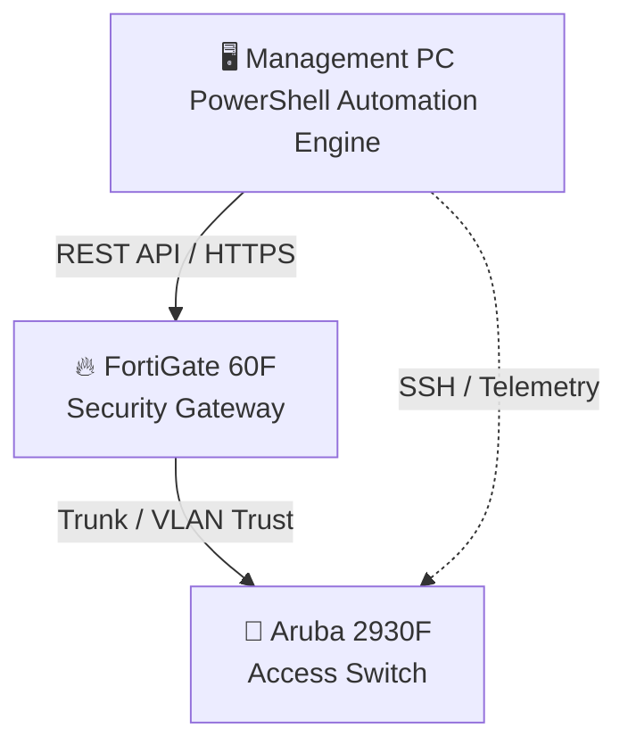

## 🛰 Network Topology

## Logic Flow
1. Script loads credentials from config.json.
2. Script sends a "Request" to Fortinet for CPU/RAM status.
3. Script sends a "Request" to Aruba for Port status.
4. Script displays a unified health report in the console.
